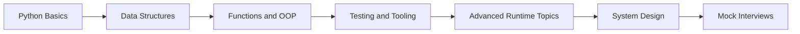

# Python Interview Prep

A professional, open-source Python interview handbook for software engineers preparing for beginner, intermediate, senior, staff, and principal-level interviews.

## Table of Contents
- [Project Overview](#project-overview)
- [Features](#features)
- [Difficulty Levels](#difficulty-levels)
- [Learning Roadmap](#learning-roadmap)
- [Repository Structure](#repository-structure)
- [Topics Covered](#topics-covered)
- [Study Plan: 7 Days](#study-plan-7-days)
- [Study Plan: 30 Days](#study-plan-30-days)
- [Study Plan: 60 Days](#study-plan-60-days)
- [Interview Tips](#interview-tips)
- [Contribution Guide](#contribution-guide)
- [Resources](#resources)
- [Star History](#star-history)
- [License](#license)

## Project Overview
Python interviews test much more than syntax. Strong candidates can solve problems, explain trade-offs, reason about complexity, debug production failures, design APIs, write maintainable code, and communicate clearly. This repository is designed as a long-term preparation system: learn a concept, answer interview questions, solve exercises, review cheat sheets, and practice realistic interview rounds.

## Features
- 100+ topic guides with interview questions, detailed answers, examples, mistakes, best practices, and coding challenges.
- 110 progressively difficult coding exercises across strings, arrays, dictionaries, recursion, searching, sorting, OOP, files, APIs, concurrency, and data processing.
- Mock interview tracks for junior through principal engineers.
- FAANG-style company preparation for Google, Amazon, Microsoft, Meta, Netflix, and Apple.
- Cheat sheets for Python syntax, built-ins, collections, itertools, functools, datetime, typing, and asyncio.
- Project briefs with implementation guidance and interview talking points.
- Cross-linked Markdown structure designed for continuous expansion.

## Difficulty Levels
| Level | Focus | Outcome |
|---|---|---|
| Beginner | Syntax, data structures, control flow, functions | Write correct small programs confidently. |
| Intermediate | OOP, typing, packaging, testing, decorators | Build maintainable application code. |
| Advanced | concurrency, internals, memory, metaprogramming | Explain trade-offs and diagnose production issues. |
| Expert | CPython, bytecode, profiling, performance | Reason from implementation details when appropriate. |
| Staff+ | system design, architecture, reviews, leadership | Design robust services and communicate technical direction. |

## Learning Roadmap

## Repository Structure
- `beginner/` - Beginner topic guides
- `intermediate/` - Intermediate topic guides
- `advanced/` - Advanced topic guides
- `expert/` - Expert topic guides
- `web-development/` - Web Development topic guides
- `database/` - Database topic guides
- `testing/` - Testing topic guides
- `best-practices/` - Best Practices topic guides
- `design-patterns/` - Design Patterns topic guides
- `system-design/` - System Design topic guides
- `coding-exercises/` - 110 coding problems with solutions and complexity analysis
- `interview-scenarios/` - mock rounds by seniority level
- `faang/` - company-specific preparation guides
- `cheat-sheets/` - concise reference material
- `projects/` - hands-on portfolio and interview projects
- `docs/` - contributor and study documentation
- `assets/` - diagrams and media placeholders

## Topics Covered
This repository covers Python fundamentals, intermediate application development, advanced runtime behavior, expert internals, web development, databases, testing, best practices, design patterns, and backend system design.

Selected starting points:
- [Variables](beginner/variables.md)
- [Data Types](beginner/data-types.md)
- [Operators](beginner/operators.md)
- [Input Output](beginner/input-output.md)
- [Strings](beginner/strings.md)
- [Lists](beginner/lists.md)
- [Tuples](beginner/tuples.md)
- [Sets](beginner/sets.md)
- [Dictionaries](beginner/dictionaries.md)
- [Loops](beginner/loops.md)
- [Conditions](beginner/conditions.md)
- [Functions](beginner/functions.md)
- [Modules](beginner/modules.md)
- [Packages](beginner/packages.md)
- [Object-Oriented Programming](intermediate/oop.md)
- [Iterators](intermediate/iterators.md)
- [Generators](intermediate/generators.md)
- [Decorators](intermediate/decorators.md)
- [Context Managers](intermediate/context-managers.md)
- [Exception Handling](intermediate/exception-handling.md)
- [File Handling](intermediate/file-handling.md)
- [Collections](intermediate/collections.md)
- [Dataclasses](intermediate/dataclasses.md)
- [Enum](intermediate/enum.md)
- [Typing](intermediate/typing.md)
- [Virtual Environment](intermediate/virtual-environment.md)
- [Pip](intermediate/pip.md)
- [Packaging](intermediate/packaging.md)
- [Multithreading](advanced/multithreading.md)
- [Multiprocessing](advanced/multiprocessing.md)
- [AsyncIO](advanced/asyncio.md)
- [Global Interpreter Lock](advanced/gil.md)
- [Memory Management](advanced/memory-management.md)
- [Garbage Collection](advanced/garbage-collection.md)
- [Metaclasses](advanced/meta-classes.md)
- [Reflection](advanced/reflection.md)
- [Monkey Patching](advanced/monkey-patching.md)
- [Closures](advanced/closures.md)
- [Descriptors](advanced/descriptors.md)
- [Slots](advanced/slots.md)

See each section README for the full index.

## Study Plan: 7 Days
| Day | Focus |
|---|---|
| 1 | Beginner syntax, strings, lists, dictionaries, and 10 easy exercises. |
| 2 | Functions, modules, OOP, exceptions, and 10 easy-medium exercises. |
| 3 | Iterators, generators, decorators, context managers, and pytest basics. |
| 4 | Recursion, searching, sorting, and data structure problems. |
| 5 | AsyncIO, threading, multiprocessing, GIL, and performance basics. |
| 6 | API design, databases, caching, and one project brief. |
| 7 | One mock interview, FAANG review, cheat sheets, and weak-area revision. |

## Study Plan: 30 Days
- Days 1-5: Finish beginner guides and 25 exercises.
- Days 6-10: Finish intermediate guides and 25 more exercises.
- Days 11-15: Study testing, packaging, typing, and design patterns.
- Days 16-20: Study advanced runtime topics and concurrency.
- Days 21-24: Practice web, database, and system design topics.
- Days 25-27: Build or review two projects.
- Days 28-30: Complete mock interviews and company-specific prep.

## Study Plan: 60 Days
- Weeks 1-2: Python fundamentals and beginner exercises.
- Weeks 3-4: Intermediate Python, testing, packaging, and OOP design.
- Weeks 5-6: Advanced topics, internals, profiling, and performance.
- Week 7: System design, databases, queues, caching, Docker, Kubernetes.
- Week 8: FAANG interview loops, mock interviews, projects, resume talking points.

## Interview Tips
- Clarify inputs, outputs, constraints, and edge cases before coding.
- State a brute-force approach, then improve it with a clear trade-off.
- Use Pythonic code, but avoid cleverness that hides intent.
- Write tests mentally or explicitly: empty input, one element, duplicates, invalid data, and large input.
- Communicate complexity and operational implications.
- For senior roles, discuss maintainability, API contracts, observability, and failure modes.

## Contribution Guide
Contributions are welcome. Start with [CONTRIBUTING.md](CONTRIBUTING.md), follow the topic-page structure, keep examples executable, and include complexity analysis where applicable.

## Resources
- [Python Documentation](https://docs.python.org/3/)
- [PEP 8](https://peps.python.org/pep-0008/)
- [Pytest Documentation](https://docs.pytest.org/)
- [FastAPI Documentation](https://fastapi.tiangolo.com/)
- [Django Documentation](https://docs.djangoproject.com/)
- [PostgreSQL Documentation](https://www.postgresql.org/docs/)

## Star History
Star history chart placeholder. Add a generated chart after the repository is published.

## License
This project is released under the [MIT License](LICENSE).
